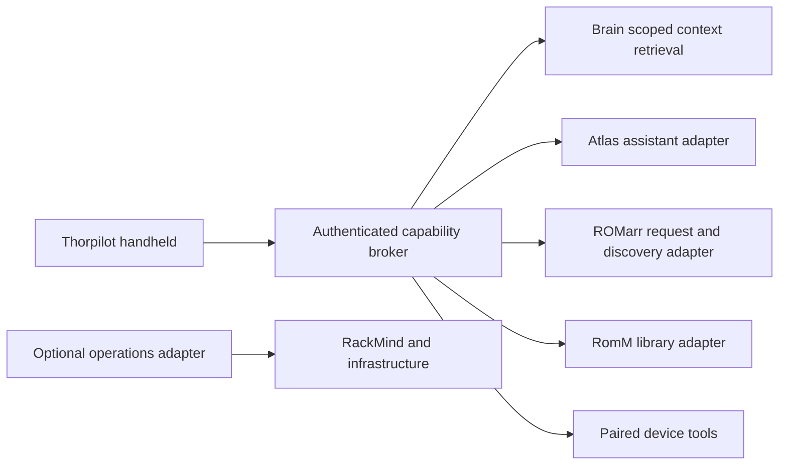

# Service integrations

Thorpilot can become a handheld surface for an existing personal assistant and context library. Brain is the knowledge product; Atlas is an assistant that uses it. An infrastructure host also named Atlas is a separate thing. Sharing a name or host does not make these services interchangeable or give Thorpilot access to them.

This document separates contracts inspected in source from proposed Thorpilot adapters. Inspection was read-only: no new connections, repository indexing, imports, account grants or deployment changes were made. Existing-service descriptions below are source evidence, not fresh verification that a particular installation is reachable.

## Responsibilities and current status

| Component | Verified role or contract | Thorpilot status |
| --- | --- | --- |
| Brain | Knowledge graph of nodes and typed edges; gateway APIs support search, recent context, individual nodes and grounded chat. Its MCP wrapper also exposes capture and linking writes. | Proposed context adapter; not connected. |
| Project/context library | Brain's Atlas context route searches imported project documentation and conversation excerpts, lists coverage, and returns bounded GitHub snapshots with timestamps. This is selective retrieval, not a complete source-code index. | Proposed read-only evidence source. |
| Atlas assistant | Home Assistant integration exposes scoped memory/project-context tools, with separate research-worker and display facilities. It consumes Brain context rather than being the context database itself. | Proposed assistant-service adapter; no general Atlas chat API has been validated for Thorpilot. |
| Atlas infrastructure host | A place services may run. Host reachability, assistant availability and context freshness are independent states. | No built-in host configuration or management adapter. |
| RackMind | Infrastructure CLI/MCP for Proxmox and SSH, with an explicit read-only mode. It is an operations plane, not the personal knowledge library. | Optional future service-health adapter; never implicitly enabled by connecting Brain. |
| ROMarr companion fork | Custom authenticated request-status and game-chat endpoints. The fork can delegate acquisition/import when configured by its operator. | Implemented optional request-status and discovery-chat clients. Chat itself does not request downloads. |
| RomM | The library-service boundary used by the ROMarr library integration; distinct from request and assistant state. | No direct Thorpilot adapter verified in this inspection. Library browsing/sync remains separate work. |

The native ROMarr client uses operator-configured HTTPS and a saved API key. See [chat-adapter.md](chat-adapter.md) for its exact request/response and privacy contract. Browser prototype request normalization lives in `src/romarr.mjs`; neither client establishes a connection to Brain or Atlas.

## What the context implementation actually provides

The inspected Brain gateway has `POST /atlas-memory/context` with `operation` values `catalog`, `search` and `github`. Search accepts a bounded query, an optional project filter, and a source-kind filter. The implementation uses an explicit read-only database transaction, a 2.5-second statement timeout and at most six search excerpts. Results retain source identity, metadata and indexing time. GitHub results are bounded snapshots; the implementation labels snapshots older than 30 minutes stale.

Its existing read key authenticates multiple read endpoints. A project query filter is a retrieval selector, **not an authorization boundary**. Before using this from Thorpilot, introduce a broker or enforceable scoped grant that limits the allowed projects and operations. Do not copy a general Brain master credential or an existing assistant credential into the handheld.

The documented refresh pipeline imports an approved repository set, uses tracked documentation rather than arbitrary source files, and requires deliberate registry changes for new repositories or changed origins. Conversation imports are distinct from recurring documentation refresh. This inspection did not extend that registry. A large development workspace must not silently become Thorpilot's searchable corpus.

Brain's broader MCP wrapper has `brain_search`, `brain_ask`, `brain_context`, `brain_get_node` and `brain_related`, as well as write tools `brain_capture` and `brain_link`. Reusing the entire wrapper would expose a broader capability set than a read-only game companion needs. Its generic chat endpoint is not evidence of an Atlas-compatible conversation/session protocol.

Atlas's documented voice-memory flow separates captured turns, suggested facts, administrator review and confirmed memory retrieval. Historical assistant replies and unreviewed suggestions must retain their provenance; they are not automatically confirmed user preferences. Research jobs and paired display delivery are additional facilities with their own contracts, not proof that arbitrary device actions are available.

## Proposed connection model

This diagram is a proposal. The current ROMarr clients do not yet use this shared broker. Infrastructure operations should be an independently granted capability, not an automatic consequence of enabling assistant chat.

A first useful integration is read-only: “What did I decide about my handheld setup?” retrieves a small number of selected project excerpts and returns citations, source dates and missing-coverage warnings. Next, an Atlas assistant adapter could combine that context with explicitly allowed live request/library tools. It must have a tested API, session semantics, cancellation, timeouts and honest unavailable states before the UI presents it as connected.

Suggested evidence envelope: source service, stable source ID, project, excerpt, source timestamp, retrieval timestamp, freshness and provenance. Keep conversation history, confirmed preferences, repository observations, live device state and library/download state distinct. A stale setup note must not override the device's current configuration.

## Boundaries for implementation

- Configure each service independently with per-user credentials and revocation. Ship no private endpoints, host profiles or account configuration.
- Keep context retrieval read-only initially. Saving a preference, capturing a Brain node or changing a setting must be a separate named operation with a visible result.
- Treat retrieved documents, repository instructions and historical chats as untrusted evidence. They cannot authorize tools, broaden credentials or start jobs.
- Show what context will leave the selected service for model inference. Support source/project exclusions and clear local history separately from remote retention.
- Preserve service-owned durable IDs. A successful assistant answer is not proof that a request, transfer, install or emulator change succeeded.
- Add contract tests and synthetic integration fixtures before live connections. Test revocation, stale evidence, empty coverage, cross-project denial, provider failure and cancellation.

## Evidence and limits

The architecture inspection used Brain's `AGENTS.md`, `tools/brain-mcp/README.md` and `index.mjs`, `tools/atlas-memory/CONTEXT.md`, the Atlas memory/worker documentation, and gateway routes `atlas-context.ts` and `atlas-memory.ts`. The older Brain overview describes an early phase; later implementation and scoped-context documentation provide more specific evidence. The existing code graph was queried but did not establish these newer backend relationships, so the named source contracts were read directly.

Other nearby memory projects were not assumed to be the production context library: Agent Memory OS documents a separate SQLite-based framework with limited retrieval, while Collective Memory's README is a generic application scaffold. No verified dependency from Brain/Atlas to either was established. They should not be described as connected services based on their names alone.

See [architecture.md](architecture.md) for the overall companion boundary and [copilot-delivery.md](copilot-delivery.md) for staged delivery gates.
